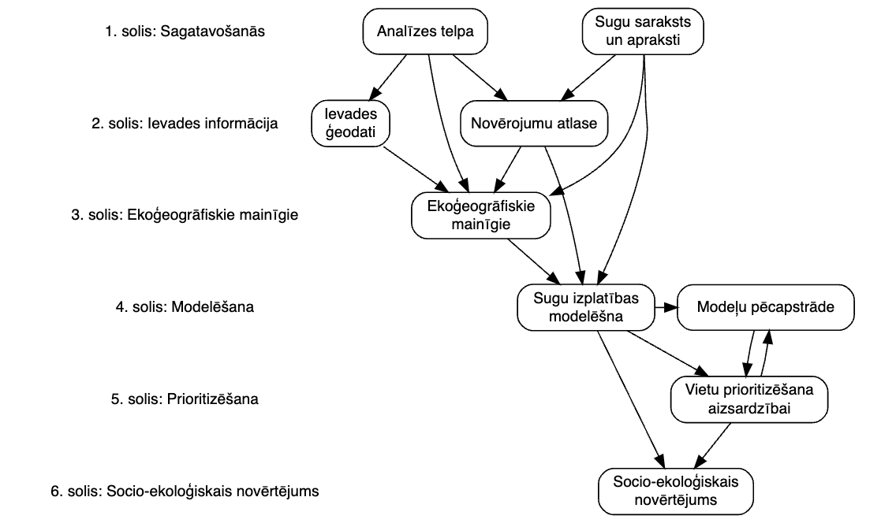

# Apmācības projekta "HiQBioDiv" ietvaros

Materiāli apmācībām projekta “Augstas izšķirtspējas bioloģiskās daudzveidības 
kvantificēšana dabas saglabāšanai un apsaimniekošanai: HiQBioDiv” 
(VPP-VARAM-DABA-2024/1-0002) ietvaros

### Ievads

Projekta mērķis ir piedāvāt jaunas zināšanas par ES aizsargājamo sugu un biotopu 
ar nelabvēlīgu vai nezināmu aizsardzības statusu un putnu sugu ar negatīvām vai 
nezināmām populācijas tendencēm dabas aizsardzības plānošanai, pielāgojumiem klimata 
pārmaiņām un socio-ekonomiskajiem novērtējumiem Latvijā. Šī mērķa sasniegšanā liela 
nozīme ir ekoloģiskajām datu analīzēm, kas saistītas ar sugu izplatības modelēšanu. 
Šajās metodēs objekts var būt ne tikai taksonomiskā vienība, tomēr šī projekta ietveros, 
galvenokārt, tieši tāds tas būs. 

Kā nereti datu analīžu uzdevumos, arī sugu izplatības modelēšanā, pati modeļu 
sagatavošana ir relatīvi neliela daļa no visiem veicamajiem darbiem, no kuriem lielāko 
daļu laika aizņem sagatavošanās modelēšanai (pirmais līdz trešais solis 1. att.).

1. attēls. Vispārīga darba gaita projekta HiQBioDiv ar sugu izplatības modelēšanu saistītajiem uzdevumiem.

Daļu no pirmajā attēlā demonstrētajiem soļiem veiks projekta darbinieki ar padziļinātām 
zināšanām sugu bioloģijā un ekoloģijā. Daļu – personas ar ekspertīzi ekoloģisko datu analīzē, 
ekonomikā vai citur. Tomēr, lai visa darba plūsma spētu sasniegt augstvērtīgu rezultātu, katra darba veicējiem 
ir ieteicama (un ekoloģiskajiem modelētājiem – nepieciešama) vismaz minimāla izpratne par visiem uzdevumiem, lai 
nodrošinātu augstāko no sevis atkarīgo uzdevumu izpildes kvalitāti kopējo mērķu sasniegšanai. Jo sevišķi tas attiecas uz 
modelēšanā iesaistītajām personām. Konspektīvs veicamo uzdevumu apraksts:

1.	solis. Sagatavošanās. Pamata darbības, kuru ietvaros pieņemtie lēmumi ietekmēs visu turpmāko 
datu un informācijas plūsmu projekta gaitā. Izdalāmas divas kopas:
    
    a.	Sugu saraksts un apraksti. Lai nodrošinātu ilgtspējīgu dabas kapitāla apsaimniekošanu, 
    nepieciešama atbilstošu vides stāvokli raksturojošu vērtību izvēle. Šī projekta ietveros tam 
    galvenokārt tiks izmantotas aizsargājamās, bioloģisko daudzveidību indicējošās un ar dabas aizsardzības 
    lietussarga īpašībām saistītās sugas, aptverot gan augu, gan sēņu, gan dzīvnieku valstis. Konkrētu sugu izvēle 
    būs dabas ekspertu uzdevums. Ekspertiem, sadarbojoties ar modelētājiem, katrai izvēlētajai sugai būs 
    jānodrošina uzticamu izplatības datu (klātbūtnes, skaita, blīvuma u.tml.) atlase un sugu bioloģijas un 
    ekoloģijas apraksti ekoloģiski pamatotu statistisko modeļu sagatavošanai.
    
    b.	Analīzes telpa. Ģeogrāfiskie slāņi (vektora un rastra formātos), kas kalpo par telpisko masku un 
    pamatni visu sekojošo datu precīzai telpiskajai noformēšanai (telpiskais pārklājums un izšķirtspēja, 
    koordinātu atskaites sistēma, šūnu novietojums, dažādas izšķirtspējas vietai unikāli identifikatori un 
    to savstarpējā sasaiste starp dažādiem slāņiem). 

2.	solis. Ievades informācija. Sugu izplatības modelēšanai nepieciešamā izvades informācija. 
Izdalāmas divas kopas:
    
    a.	Sugu novērojumi. Uzticamu izplatības datu sagatavošana – dabas ekspertu uzdevums. 
    Atkarībā no sugas, tie var būt dažāda veida dati, sākot ar tikai drošām klātbūtnēm, 
    beidzot ar nepilnīgas konstatēšanas analīzēm piemērotām datu kopām. Visus datus nepieciešams 
    pilnvērtīgi aprakstīt, sniedzot informāciju par taksonomisko vienību, novērošanas vietu, 
    novērošanas laiku, indivīda statusu un citu pavadošo informāciju, kas pakārtota datu ieguves 
    veidam un var būt nepieciešama ekoloģisko procesu ietveršanai statistiskajos modeļos.
    
    b.	Ievades ģeodati. Lai modelētu sugu izplatību atkarībā no vides apstākļiem un to 
    projicētu ģeogrāfiskajā telpā, ir nepieciešami ģeogrāfiski referencēti vides apraksti. 
    Paši apraksti, kad sagatavoti analīzei piemērotā formā tiek dēvēti par ekoģeogrāfiskajiem 
    mainīgajiem (3. solis), tomēr to sagatavošanai ir nepieciešams kombinēt dabas ekspertu 
    sniegto informāciju par sugu nepieciešamībām ar pieejamajiem ģeoreferencētajiem vidi 
    raksturojošajiem datiem, nepieciešamības gadījumā izstrādājot jaunus produktus, kas 
    kalpos par pamatu turpmākajām analīzēm. Šiem pamata ģeodatiem ir jābūt tādiem, kas ar 
    salīdzināmu nenoteiktību aptver visu analīzes telpu nepieciešamajā izšķirtspējā (1.b. solis).

3.	solis. Ekoģeogrāfiskie mainīgie. Ekoloģiski pamatoti ģeoreferencēti vides apraksti, kas 
izmantojami kā neatkarīgo mainīgo matrica sugu izplatības modelēšanā. Visbiežāk precīzi sugu 
vajadzības raksturojoši mainīgie nebūs izveidojami – nepieciešams kombinēt labāko izpratni par 
ekoloģiju (no aprakstiem 1.a. solī) ar zināšanām par pieejamajiem (un/vai sagatavojamiem, 
izstrādājamiem) ģeodatiem (2.b solis), lai nodrošinātu analītiskās informācijas telpu. 
Ekoģeogrāfiskie mainīgie sagatavojami kā rastra slāņi ar precīzi sakrītošu šūnu izmēru un 
izvietojumu (tajā skaitā iztrūkstošās, fona vērtības) un vienu un to pašu koordinātu 
atskaites sistēmu (atbilstoši 1.b. solim).

4.	solis. Modelēšana. Ekoloģiski pamatotu statistisko modeļu sagatavošana un apstrāde. 
Izdalāmi divi secīgi soļi:

    a.	Sugu izplatības modelēšana. Atkarībā no iegūstamā rezultāta veida, pieejamo 
    datu veidiem, to kvalitātes un papildaprakstiem kā arī pieejamajiem skaitļošanas 
    resursiem un nepieciešamās vispārināšanas spējas, ir pieejami dažādi ekoloģiskās 
    statistikas līdzekļi sugu izplatības modelēšanai. Šī projekta un apmācību ietvaros 
    fokusēsimies uz tikai klātbūtnes modeļiem ar maksimuma entropijas analīzi. Neatkarīgi 
    no modeļa veida, nozīmīgs darbs ir veicams tā parametrizācijā, iekšējā un ārējā kalibrēšanā 
    un validēšanā. Nav noliedzama senā atziņa, ka 
    [visi modeļi ir nepareizi](https://en.wikipedia.org/wiki/All_models_are_wrong) – 
    mūsu uzdevums ir tos padarīt 
    par vismaz noderīgiem un tik uzticamiem, cik tas šobrīd ir iespējams, tālāk neizplatot neuzticamos.

    b.	Modeļu pēcapstrāde. Šī projekta kontekstā modeļu pēcapstrāde ir saistīta ar 
    projicētās izplatības klasifikāciju (binarizēšanu sugai piemērotajās un nepiemērotajās 
    vietās), projicētās izplatības asociēšanu ar modelī neiekļautiem telpiskajiem griezumiem, 
    projekcijas jaunā vidē, apvienotu ekoloģiskās atbildes funkciju sagatavošanu un tamlīdzīgi.

5.	solis. Prioritizēšana. Vietu (rastra šūnu modeļa projekciju izšķirspējā) 
prioritizēšana dabas aizsardzībai. Ik vienai sugai pašai par sevi un dažādām to 
kombinācijām ar savstarpēji aditīvajiem efektiem, izmantojot korektus (sugu bioloģijā 
un ekoloģijā, populācijas stāvoklī, modeļu veikstspējā un ārējos novērtējumos balstītos) 
sugu lomu biodaudzveidības apsaimniekošanā raksturojošus svarus.

6.	solis. Socio-ekoloģiskais novērtējums. Ekosistēmu pakalpojumu un tautsaimniecības 
ekonomiskajos aprēķinos balstīts novērtējums esošajam dabas aizsardzības teritoriālajam 
regulējumam, šī projekta rezultātā ieteiktajam teritoriālajam regulējumam un vismaz vienam 
papildus apsaimniekošanas scenārijam kā piemērs ietekmes novērtējumu procedūrām.

Šajās apmācībās daudz uzmanības veltīsim augstāk minētajam trešajam solim (ar cieši 
saistīto 2.b. soli), kuru pamazām saistīsim ar ceturto un piekto soļiem, regulāri 
atgriežoties pie trešā. Lai labāk saprastu ceturto soli, neizbēgami būs nepieciešams 
izmēģināt arī soļus 1.a un 2.a.

Projektā kopumā visus ar datu apstrādi un analīzi saistītos uzdevumus ir paredzēts 
sagatavot ne tikai reproducējami, bet arī, cik vien iespējams, replicējami. 
Tas nozīmē darbu komandrindās, dalīšanos ar tām un to publiskošanu. Ņemot vērā 
pieejamos materiālus, projekta komandas un zinātniskās sabiedrības preferences, cik 
vien iespējams, izmantosim R, atsevišķos soļos to papildinot ar 
*Google Earth Engine* tīmekļa pārlūka saskarni (JavaScript), jebkuru alternatīvu 
un paplašinājumu izvērtējot ļoti kritiski. 

### Ieteiktie informācijas avoti

Labi formulēts jautājums jebkurā SEO (search engine optimizer; meklētājā), piemēram, 
https://www.google.com/, var piedāvāt labus risinājumus, tomēr var aizvest arī briesmīgos neceļos. 
Parasti, ja meklēšanas rezultāts aizved pie https://stackoverflow.com/, kāds no ieteiktajiem 
risinājumiem var būt labs (var arī nebūt, ne obligāti Jūsu izaicinājumam atbilstošākais ir tas, 
kurš ir atzīmēts kā jautājuma uzdevējam labākais). Lielo valodas modeļu (LLMs), piemēram, 
chatGPT, izmantošana nav aizliegta, bet ir ļoti rūpīgi jāizvērtē ieteiktie risinājumi, tos 
pedantiski jāpārbauda. Gan pēc būtības, gan loģikas. Gan pieejā, gan rezultātā.

Darbā ar Google Earth Engine labs palīgs ir izstrādātāju sagatavotā 
[digitālā grāmata](https://www.eefabook.org/), kas saistāma ar [pamācībām](https://google-earth-engine.com/). 
Noderīgi var būt [Ujaval Gandhi izstrādātie materiāli](https://courses.spatialthoughts.com/end-to-end-gee.html),  
kas pieejami ne tikai par GEE.

Labākai izpratnei par R, lieliski noderēs šie materiāli: 
  
  •	[R for data science](https://r4ds.had.co.nz/);

  •	[Advanced R](http://adv-r.had.co.nz/);
  
  •	[Mastering Software Development in R](https://bookdown.org/rdpeng/RProgDA/).

R ir izmantojama kā ģeoprocesēšanas rīks:
  
  •	[Geocomputation with R](https://r.geocompx.org/);

  •	[Spatial Data Science](https://r-spatial.org/book/);
  
  •	[Spatial Data Science with R and “terra”](https://rspatial.org/index.html);

  •	[Using Spatial Data with R](https://cengel.github.io/R-spatial/);

  •	apbrīnojami jaudīgs ģeoprocesēšanas rīks, kurš ir vadāms, izmantojot R komandrindas, 
  ir [WhiteboxTools](https://www.whiteboxgeo.com/manual/wbt_book/preface.html).

Tomēr galvenais ieguvums R lietotājiem ir iespēja apvienot ģeoprocesēšanas 
uzdevumus ar statistisko analīzi, kurā mērķtiecīgi ņemtas vērā 
[telpiskās (un temporālās, ja nepieciešams) īpašības](https://spacetimewithr.org/book), 
nodrošinot skaidru reproducējamību 
vai pat replicējamību, ja ir iespējams dalīties ar ievades datiem. Vismaz daļēji tas ir nozīmīgi 
arī sugu izplatības modelēšanā, kas nedaudz ieskicēta ir jau iepriekšējos resursos, vairāk 
ekoloģiskā griezumā (un ar dažiem citiem datu analīzes R resursiem) to piedāvāju iegūt raksto man e-pastu
(andris.avotins@lu.lv).

Projekta gaitā daļu iegūto rezultātu un to izstrādes procedūru publiskosim, 
izmantojot atvērtās grāmatas pieeju [{bookdown}](https://bookdown.org/yihui/bookdown/), 
kurai pamatā ir [{RMarkdown}](https://bookdown.org/yihui/rmarkdown/) – nav aizliegts izmantot 
[{Quarto}](https://quarto.org/docs/computations/r.html), tomēr šobrīd nobriedušāku rezultātam 
nepieciešamo risinājumu sniedz R Makrdown izpildījums, tādēļ vismaz sākumā fokusēsimies uz to. 
Projekta ietvaros, interaktīvas rezultātu izpētes nodrošināšanai, apsveram 
[{shiny}](https://mastering-shiny.org/) risinājumu – neskādēs iepazīties arī ar to.

### Dati un datu drošība

Šī projekta publiskie dati ir ievietoti projekta 
[Zenodo sabiedrības vietnē](https://zenodo.org/communities/hiqbiodiv/about), 
komandu rindas – [github kontā](https://github.com/aavotins/HiQBioDiv). 
Ar neko no resursiem, kurus 
saņemat šo apmācību un darba projektā laikā, nedrīkst dalīties, tos nedrīkst jebkādā 
tiešā veidā pavairot vai izplatīt, ja vien tie nav pieejami kā šī projekta vai citādi 
atvērtie dati. Tas attiecas arī uz dažāda līmeņa starprezultātiem. Arī tad, ja to 
autori esat Jūs. Arī tad, ja ir saspringti termiņi.

Kā zināms, ar nekādām parolēm un piekļuves tiesībām dalīties nedrīkst, 
tās nedrīkst izmantot nelietīgi. Tas attiecas arī (jo sevišķi!) uz resursiem, 
kuriem Jums tiks sniegta piekļuve šī projekta daļu ietvaros. Arī skaitļošanas un 
datu glabāšanas un apmaiņas resursiem.

### Liriskā atkāpe

Ir sagaidāms, ka ne ar visiem uzdevumiem pilnā apjomā uzreiz tiksiet galā. 
Tādēļ mācības! Papildus apmācībai pašai par sevi, šo uzdevumu viens no mērķiem 
ir iepazīt Jūsu domāšanu un problēmu risināšanas spējas, apzinoties, ka katram no 
Jums būs kādas stiprās puses, uz kurām tālāk fokusēt Jūsu uzdevumus projektā. Lūdzu, 
uzdevumu risināšanā esiet godīgi un ļaujiet projekta komandai pamanīt savas stiprās puses.

Reizēm nespēt visam uzreiz izsekot ir labi – ja reiz to apzināties, tas nozīmē, 
ka Jūs cenšaties. Reizēm sajusties par muļķi ir nepieciešams – tas nozīmē, ka ir iespējas 
izaugsmei un ar to varbūt pat gūt lielus panākumus – ja viss šķiet pārāk viegli, darbs 
šajā projektā, iespējams, nav Jums piemērotākā izvēle 
([Schwartz. 2008](https://web.stanford.edu/~fukamit/schwartz-2008.pdf)). 
Tomēr, ja nespējat saprast un atrisināt neko vai gandrīz neko no sekojošajiem uzdevumiem, 
darbs šajā projektā nav Jums piemērots.

### Uzdevumi

Precīzi visu uzdevumu formulējumi tiks publiskoti apmācību gaitā. 
Tie būs pieejami šī repozitorija atsevišķās direktorijās.

Apmācības sāksies ar patstāvīgajiem darbiem - individuālu iepazīšanos ar piedāvātajiem
informācijas avotiem un patstāvīgu zemāk uzskaitīto uzdevumu izpildi. Šī kursa ietvaros 
pieņemam, ka tā dalībniekiem ir pamata priekšzināšanas darbā ar R un kādu ĢIS (ģeogrāfiskās 
informācijas sistēmu) un pamata līmeņa izpratne par ģeodatiem un to apstrādi. Tādēļ 
apmācību sākumā ir patstāvīgi pildāmi pirmie uzdevumi, kuru rezultāti tiks pārrunāti, 
uzsākot klātienes tikšanās no 2025. gada janvāra vidus. Šo klātienes tikšanos laikā arī 
tiks piedāvāts ieskats teorētiskajā pamatojumā un piemēros nākošajām nodarbībām. Tātad, 
uz katru nodarbību ir jāsagatavojas, izpildot visus līdz tam paredzētos uzdevumus un 
jau laicīgi ir jāiegulda laiks, lai iepazītos ar piedāvātajiem informācijas resursiem 
apmācību tēmai kopumā.

Sagaidāmie uzdevumi (virsrakstu līmenī):

1. uzdevums: [sagatavošanās darbam](./Uzd01/PirmaisUzdevums.md) 

Nosacījumi: **pieejami**; Risinājuma iesniegšana līdz: **2024-12-15**

2. uzdevums: [vektordati, to ģeometrijas, atribūti un failu formāti](./Uzd02/Uzdevums02.md) 

Nosacījumi: **pieejami**; Risinājuma iesniegšana līdz: ~~(2025-01-10)~~ ~~(2025-01-27)~~ **2025-02-07**

3. uzdevums: [rastra dati, rasterizēšana un kodējumi](./Uzd03/Uzdevums03.md) 

Nosacījumi: **pieejami**; Risinājuma iesniegšana līdz: ~~(2025-01-10)~~ ~~(2025-01-27)~~ **2025-02-07**

4. uzdevums: [funkcijas, cikli, vienkodola un daudzkodolu skaitļošana](./Uzd04/Uzdevums04.md) 

Nosacījumi: **pieejami**; Risinājuma iesniegšana līdz: ~~(2025-01-10)~~ ~~(2025-01-27)~~ **2025-02-07**

5. uzdevums: [procesu dalīšana un rezultātu apvienošana](./Uzd05/Uzdevums05.md) 

Nosacījumi: **pieejami**; Risinājuma iesniegšana līdz: ~~(2025-01-15)~~ ~~(2025-01-27)~~ **2025-02-07**

6. uzdevums: [dažādu slāņu savienošana vienotai ainavas aprakstīšanai](./Uzd06/Uzdevums06.md) 

Nosacījumi: **pieejami**; Risinājuma iesniegšana līdz: ~~(2025-01-15)~~ ~~(2025-01-27)~~ **2025-02-07**

7. uzdevums: [zonālā statistika](./Uzd07/Uzdevums07.md) 

Nosacījumi: **pieejami**; Risinājuma iesniegšana līdz: ~~(2025-01-15)~~ ~~(2025-01-27)~~ **2025-02-07**

8. uzdevums: [GEE](./Uzd08/Uzdevums08.md) 

Nosacījumi: **pieejami**; Risinājuma iesniegšana līdz: ~~(2025-01-15)~~ ~~(2025-01-27)~~ **2025-02-07**

9. uzdevums: [sugu izvēle un to aprakstu](./Uzd09/Uzdevums09.md)  
(modelēšanai un aizsardzības telpiskajai plānošanai) sagatavošana 

Nosacījumi: **pieejami**; Risinājuma iesniegšana līdz: ~~(2025-01-20)~~ ~~(2025-02-17)~~  ~~(2025-02-24)~~ **2025-03-03**

10. uzdevums: [novērojumu atlase modelēšanai](./Uzd10/Uzdevums10.md) 

Nosacījumi: **pieejami**; Risinājuma iesniegšana līdz: ~~(2025-01-20)~~ ~~(2025-02-17)~~  ~~(2025-02-24)~~ **2025-03-03**

11. uzdevums: [sugai specifiski ekoģeogrāfiskie mainīgie](./Uzd11/Uzdevums11.md) 

Nosacījumi: **pieejami**; Risinājuma iesniegšana līdz: ~~(2025-01-20)~~ ~~(2025-02-17)~~  ~~(2025-02-24)~~ **2025-03-23**

12. uzdevums: [sugu izplatības modelēšana](./Uzd12/Uzdevums12.md) 

Nosacījumi: *tiek izstrādāti*; Risinājuma iesniegšana līdz: ~~(2025-02-05)~~ ~~(2025-02-24)~~ ~~(2025-03-03)~~

13. uzdevums: [asociācijas un preferences dzīvotņu piemērotībā](./Uzd13/Uzdevums13.md) 

Nosacījumi: *tiek izstrādāti*; Risinājuma iesniegšana līdz: ~~(2025-02-12)~~ ~~(2025-03-03)~~ ~~(2025-03-10)~~

14. uzdevums: [vietu prioritizēšana aizsardzībai](./Uzd14/Uzdevums14.md) 

Nosacījumi: *tiek izstrādāti*; Risinājuma iesniegšana līdz: ~~(2025-02-19)~~ ~~(2025-03-10)~~ ~~(2025-03-24)~~

~~15. uzdevums: [vietu aizņemtība](./Uzd15/Uzdevums15.md)~~ 

~~Nosacījumi: *tiek izstrādāti*; Risinājuma iesniegšana līdz: (2025-02-26) (2025-03-24)~~

~~16. uzdevums: [populācijas lielums](./Uzd16/Uzdevums16.md)~~ 

~~Nosacījumi: *tiek izstrādāti*; Risinājuma iesniegšana līdz: (2025-03-05) (2025-03-24)~~

~~17. uzdevums: [daudzsugu izplatība](./Uzd17/Uzdevums17.md)~~ 

~~Nosacījumi: *tiek izstrādāti*; Risinājuma iesniegšana līdz: (2025-03-12)~~
